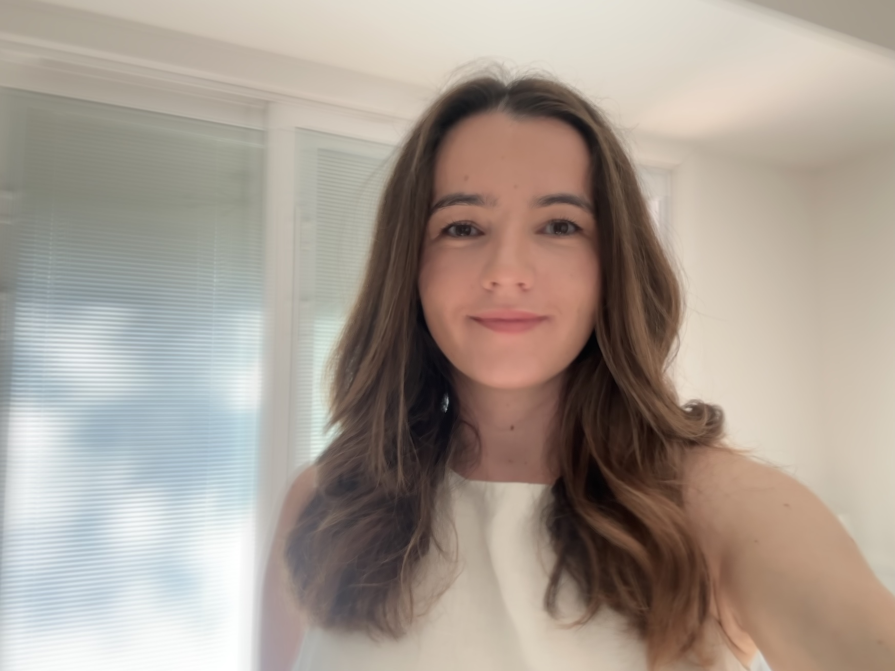

<h3>about</h3>

  

  [If you are here from X, my account has been compromised, do not open any links you may receive!]

    
  
  I am a fifth-year Ph.D. student in the <a href="https://math.utexas.edu/">Department of Mathematics</a> at the University of Texas at Austin. I have had the opportunity to gain industry experience through two back-to-back internships at <a href="https://www.amd.com/en.html">Advanced Micro Devices (AMD)</a> on the HPC team, where I worked on automating the process of code translation from Fortran into HIP through fine-tuning LLMs and using agentic AI.

    

  I am fortunate enough to be co-advised by Prof. <a href="https://math.utexas.edu/directory/stefania-patrizi">Stefania Patrizi</a> and Prof. <a href="https://math.utexas.edu/directory/rachel-ward">Rachel A. Ward</a>. I am broadly interested in nonlocal problems in analysis, deep learning methods in solving partial differential equations, and the mathematics of large language models. To see up to date published work/preprints or relevant code, here are my <a href="https://scholar.google.com/citations?user=LtO6zfcAAAAJ&hl=en">Google Scholar</a> and <a href="https://github.com/erisahasani">GitHub</a> pages.

    
  I am on the job market starting summer of 2026.

    
  <strong>Contact:</strong> ehasani [at] utexas.edu &nbsp;·&nbsp; <a href="https://www.linkedin.com/in/erisa-hasani-81107a147">LinkedIn</a> &nbsp;·&nbsp; <a href="/resume/">Resume</a>

